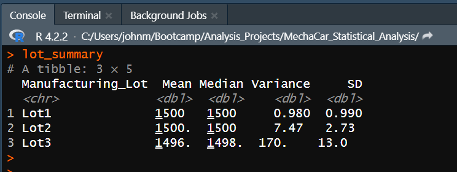

# MechaCar_Statistical_Analysis

## Linear Regression to Predict MPG
### Output from the linear regression model using multiple independent variables

Here we can see the slope cefficients (r-values) of the five independent variables. Vehicle weight and spoiler angle are considered to have no to very weak correlation to fuel efficiency (mpg) since their absolute values are less than 0.3. Vehicle length, ground clearance, and AWD are considered to have strong correlations to fuel efficiency since their absolute values are greater than 0.7. 

### Some summary statistics of the linear regression model

The above Pr(>|t|) values represent the probability that each coefficient contributes a random amount of variance to the linear model. Since the Pr(>|t|) values are very low for vehicle length and ground clearance, they are statistically likely to provide non-random amounts of variance to the linear model. In other words, vehicle length and ground clearance are likely to have a significant impact on fuel efficiency.

The r-squared value (~0.71) means that around 71% of all mpg predictions will be correct when using this linear model. The p-value of 5.35e-11 is much less than 0.05% (significance level) which means that the slope of our linear model is not zero.

## Summary Statistics on Suspension Coils

### Suspension Coil PSI Summary for All Lots

### Suspension Coil PSI Summary for Individual Lots

The design specifications for the MechaCar suspension coils dictate that the variance of the suspension coils must not exceed 100 pounds per square inch. The variance for all lots combined fall within the acceptable variance range, but the variance for Lot 3 (170PSI) far exceeds the 100PSI limit.

## T-Tests on Suspension Coils
T-tests were used to determine if the manufacturing lots are statistically different from the population mean of 1500 PSI. If the p-value from a t-test is above the commonly accepted signigicance level of 0.05%, then we do not have sufficient evidence to reject the null hypothesis. Thus, the two means would be statistically similar.

### T-test for All Lots
The p-value is 0.060 which implies the mean PSI for all lots is statistically similar to the population mean (1500 PSI).

### T-test for Lot 1
The is p-value is 1.0, so the mean for Lot 1 is also statistically similar to the population.

### T-test for Lot 2
Here again, The Lot 2 mean is statistically similar to the population.

### T-test for Lot 3
For Lot 3, the p-value is 0.042 and below the significance value. So there IS a significant statistical variation between these two means.

